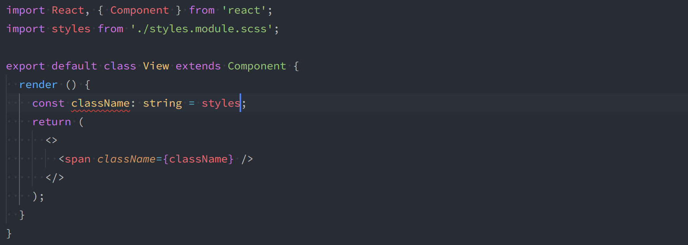

> 注意：本文仅为科普，具体详见：[CSS Modules](https://github.com/css-modules/css-modules)

## 1 css 存在的问题

#### 1.1 样式冲突

css 规范自从被制定开始就存在全局作用域的特性，使得散落在各处的样式定义一旦有重名，便会产生样式冲突问题。

```css
/* a.module.css */
.btn {
    color: red;
}
```

```css
/* b.module.css */
.btn {
    color: green
}
```

假使我们为两个不同的模块分别定义自己的样式文件，使 a 模块中的 btn 颜色设置为红色，使 b 模块中的 btn 颜色设置为绿色。但是由于css样式具有全局作用域的特性，最终web所展示的效果会与我们的预期差别很大。


**解决方案**

为解决样式冲突问题，一般我们会采用以下两种措施来保证样式名称独一无二：

- 独一无二的选择器名称（unique selector name）
- 关系选择器（combinator）

```css{3}
/* a.module.css */
/* 选取一个独一无二的classname作为选择器名称，以保证不会与其他样式名称冲突 */
.module-a-btn {
    color: red;
}
```

```css{3}
/* b.module.css */
/* 通过后代选择器，保证不会与其他选择器产生样式冲突 */
.module-b .btn {
    color: green
}
```

--- 

## 2. CSS Modules


#### 2.1 是什么以及解决了什么问题

CSS Modules 是一项规范，旨在提供模块化、可扩展的CSS。提供了以下特性：

- 解决样式冲突。
- 明确的依赖关系。
- 无全局作用域 

CSS Modules 规定，一个 CSS 文件就是一个 CSS 模块，模块中所有的 class name 和 animation name 的作用域仅限于在该CSS模块中。

```
A CSS Module === A CSS File === A CSS Scope
```

#### 2.2 如何使用

- 定义 CSS Module 文件。

```css
/* style.css */
.className {
  color: green;
}
```

- 在 JavaScript 模块中使用示例。

```jsx
import styles from "./style.css";
// import { className } from "./style.css";

element.innerHTML = '<div class="' + styles.className + '">';
```

- 在 jsx 中使用示例。

```jsx
import React from 'react'
import styles from "./style.css";
// import { className } from "./style.css";

export default function() {

    return <button className={styles.className}> click </button>
}
```

#### 2.3 工作原理

[css loader](https://webpack.js.org/loaders/css-loader/) 实现了CSS Modules规范。其原理是在编译期对 CSS Module 中的样式名称进行处理，自动为样式名称加上哈希码后缀（或其他规则），使得每一个样式名称都是独一无二的。

css-loader转译前的 CSS 文件：

```css
/* btn.module.css */
.btn {
    color: red;
}
```


css-loader转译后的 CSS 文件：

```css{2}
/* btn.module.css */
.btn-AXASD1DXXZ {
    color: red;
}
```

```jsx{4,5,6}
import React from 'react'
import styles from './btn.modules.css'

// styles = {
//     btn: 'btn-AXASD1DXXZ'
// }

export default function() {

    return <button className={styles.btn}> click </button>
}
```

---

## 3 配套方案

1. css-loader 配置

https://github.com/webpack-contrib/css-loader#modules

2. typescript 代码提示



https://github.com/mrmckeb/typescript-plugin-css-modules
